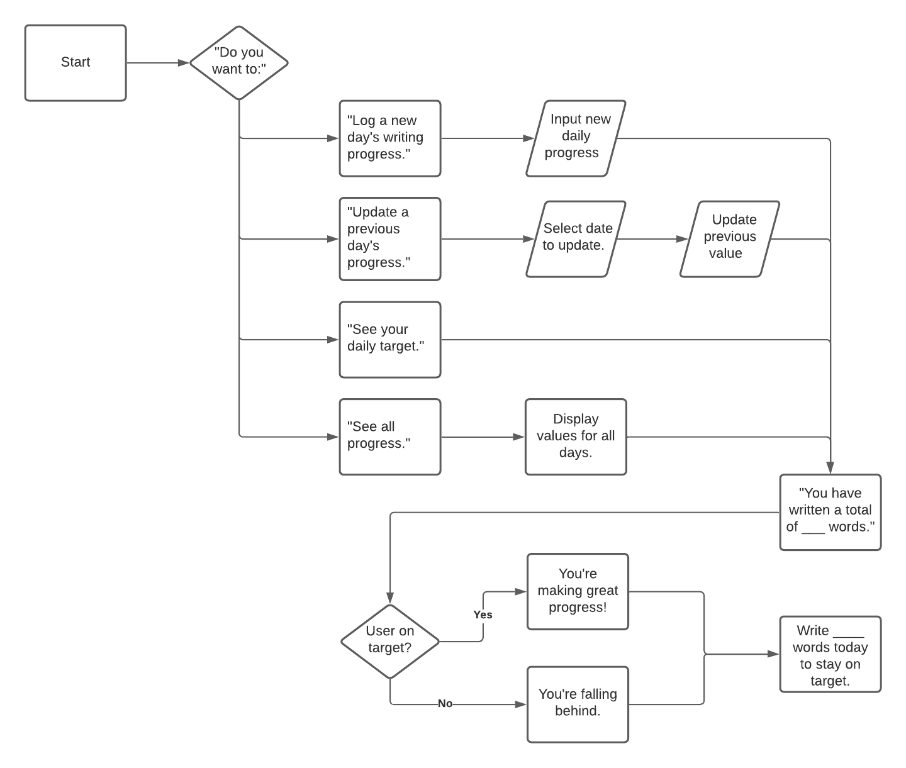

Readme

National Novel Writing Month is a yearly event in which people attempt to write an 80000 word novel in the month of November. The event puts a lot of emphasis on daily word counts and reaching goals. The purpose of this piece of software is to provide a way for a user to track their daily writing progress, to see if they are on target, and what they need to do to stay on target or to catch up with their goals if they have fallen behind. It uses a googlesheet to hold information.

# Future Features
## Multiple Users
By updating row_to_update in update_worksheet(), it would be possible to create a program that handle multiple users. As it stands, each user in the googledoc is simply a different row.

# Credits
How to set up google drive and google sheets API from the Love Sanwiches project.
Used gspread documentation to learn how update a googlesheet https://buildmedia.readthedocs.org/media/pdf/gspread/latest/gspread.pdf

Welcome robindavidgames,

This is the Code Institute student template for deploying your third portfolio project, the Python command-line project. The last update to this file was: **August 17, 2021**

## Reminders

* Your code must be placed in the `run.py` file
* Your dependencies must be placed in the `requirements.txt` file
* Do not edit any of the other files or your code may not deploy properly

## Creating the Heroku app

When you create the app, you will need to add two buildpacks from the _Settings_ tab. The ordering is as follows:

1. `heroku/python`
2. `heroku/nodejs`

You must then create a _Config Var_ called `PORT`. Set this to `8000`

If you have credentials, such as in the Love Sandwiches project, you must create another _Config Var_ called `CREDS` and paste the JSON into the value field.

Connect your GitHub repository and deploy as normal.

## Constraints

The deployment terminal is set to 80 columns by 24 rows. That means that each line of text needs to be 80 characters or less otherwise it will be wrapped onto a second line.

-----
Happy coding!