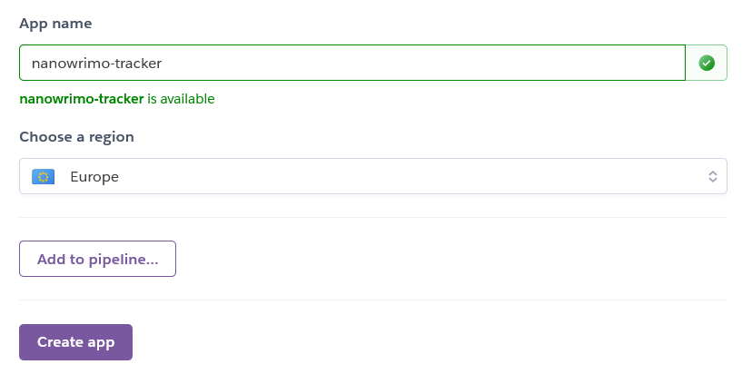

Readme

National Novel Writing Month (NaNoWriMo) is a yearly event in which people attempt to write an 80000 word novel in the month of November. The event puts a lot of emphasis on daily word counts and reaching goals.

The purpose of this piece of software is to provide a way for a user to track their daily writing progress. The user can see if they are on target, what they need to do to stay on target, and how to catch up with their goals if they have fallen behind.

It uses a googlesheet to hold information, but all data is processed within the program.

# Deployed Program
[Here is the link to the deployed program.](https://nanowrimo-tracker.herokuapp.com/)

# Flow of Operations

# Features

## Google Sheets
A Google Sheets document hosts information relating to 10 fictional users. This information is imported whenever the program is run and can be added to and updated through user actions. The default user is User 1/Row 1 in the Google Sheet.

## main()
The main() function allows the player to choose which action they would like to perform:

* Add a new day's progress.
* Update a previous day's progress.
* See your daily goal.
* See all your progress.

It uses a very simple if/elif/else series to check if the user has inputted an appopriate choice and to send them to the correct function.

## Log Day
The log_day() function allows the user to post a new day's worth of writing progress. It automatically updates the next blank day and will not let the user input more than 30 days (as that is the maximum allows in the National Novel Writing Month challenge). It calls a validation function to check the inputted value and then sends the validated data, along with the date, to a function to update the worksheet.

## Update Previous Day
The previous_day() function allows the user to go back and change historical data. It requests a date and a corrected wordcount from the user, calls the validation function to check the values, and sends all that data to a function to update the worksheet.

## See Progress
The see_progress() function outputs the values assigned to all days that have been saved. It checks the number of days, to ensure they can all fit in the terminal display and, if they cannot, breaks them into chunks for display.

## Data Validation
The validate_data() function is called from several other functions and uses try/except to ensure that any inputted data is an integer. If the data isn't an integer, validate_data() provides an error message.

    try:
        int(data_to_validate)
        return False
    except ValueError:
        print("\nData is invalid. You must input a whole number.\n")
        return True

## Updating Worksheet
The update_worksheet() function can be called from log_day() or previous_day() and will update the Google Sheet with new values. validate_data() ensured these values are appropriate.

## Users Dictionary
The total_words() function creates a list of dictionaries covering all users, containing usernames, word counts, and current days. It passes this dictionary to other functions so that the details can be analysed and the user can be presented with relevant statistics.

## User Progress
The target_message() function uses the dictionary of all users to convey some key information to the user:

* How many words they have written.
* How many words they write on an average day.
* How they rank in comparrison to all other users.

## User Goals
The see_target() function determines if the user is ahead or behind of their target to hit 80000 words by the end of the month. Depending on user progress, it provides a relevant motivational message, and offers a target word count for the next day in order to stay on track. It can also determine if the user has finished the 80000 word challenge.

## Restarting
The restart() function sends the user back to main() once they have finished their actions.

# Bugs and Issues

## Validating Data
I couldn't get my validate_data function to run correctly and check if inputted values were integers. I had created a while loop asking for an input and then within that while loop, would call validate_data(). Like this:

    while x == True:
        daily_word_count = input("Enter wordcount here: ")
        validate_data(daily_word_count)

But it didn't work! After some amount of searching forums, I asked for help on slack and was able to solve it. I hadn't assigned a varianble for validate_data() to assign its result.

    while x == True:
        daily_word_count = input("Enter wordcount here: ")
        x = validate_data(daily_word_count)

Having solved this, I was able to use validate_data() in all instances where I needed to check that inputted text was an integer.

## Managing Range of Iteration
In see_progress(), I needed to limit the number of pieces of data shown on the terminal (as there could be up to 30 pieces of data and the terminal is only 24 lines in height). As such a range set to len(data) did not work. When I tried setting the range to manual number (eg 20-30), it would result in a crash if there was less than 30 pieces of data (ie, if there were 28 days logged). To fix this error, I set the minimum at 20 and the maximum as len(data), so that the maximum boundary would be variable.

    for words in range(20, len(user_progress)):
        print(f"Day {words + 1}: {user_progress[words]} words")

## Using Enumerate instead of For loops with len and range
Although my code worked fine, GitPod was giving a warning that for loops with len and range in them are not ideal and suggested I Enumerate. I used the tutorial at [RealPython](https://realpython.com/python-enumerate/) to learn about enumerating and turned this code:

    for i in range(len(list_splice)):
        list_splice[i] = int(list_splice[i])

into this code:

    for value, user_words in enumerate(list_splice):
        list_splice[value] = int(user_words)

This is easier for a human reader to parse.

# Future Features
## Multiple Users
By updating row_to_update in update_worksheet(), etc., it would be possible to create a program that handle multiple users. As it stands, each user in the googledoc is simply a different row and all are contained in the same list of dictionaries.

# Testing
I have tested the code throroughly. I have also run through two validators, [PEP8](http://pep8online.com/checkresult#) and [Python Code Checker](https://extendsclass.com/python-tester.html).

# Deployment
The python code is deployed to Heroku as follows:

New lines are added to the end of all input fields, as per Heroku requirements.

An instruction sent to the gitpod terminal updates the requirements.txt file.

I signed up to use Heroku.

Created a new app and gave it a name.

In the settings tab, I updated the Config Vars by adding CREDS and PORT keys and values.

I added the Python and Nodejs buildpacks.

In the deploy section, I connected to GitHub and the appropriate project.

Pressing "Deploy Branch" deploys the code to Heroku.

# Software Used
* GitPod to edit code.
* GitHub to host code.
* LucidChart to build flow of operations diagram.
* Firefox browser.
* Heroku to deploy code.
* Google Sheets to host user progress values.
* Python

# Credits
How to set up google drive and google sheets API is from the Love Sanwiches project.

Used [gspread documentation](https://buildmedia.readthedocs.org/media/pdf/gspread/latest/gspread.pdf) to learn how update a googlesheet. 

## target_message() Function
The code used to sort the dictionary in target_message is modified from a [StackOverflow thread](https://stackoverflow.com/questions/72899/how-do-i-sort-a-list-of-dictionaries-by-a-value-of-the-dictionary).

The code used to find the location of the current user in that sorted dictionary is modified from a [StackOverflow thread](https://stackoverflow.com/questions/4391697/find-the-index-of-a-dict-within-a-list-by-matching-the-dicts-value).